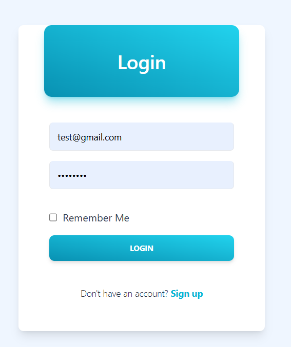
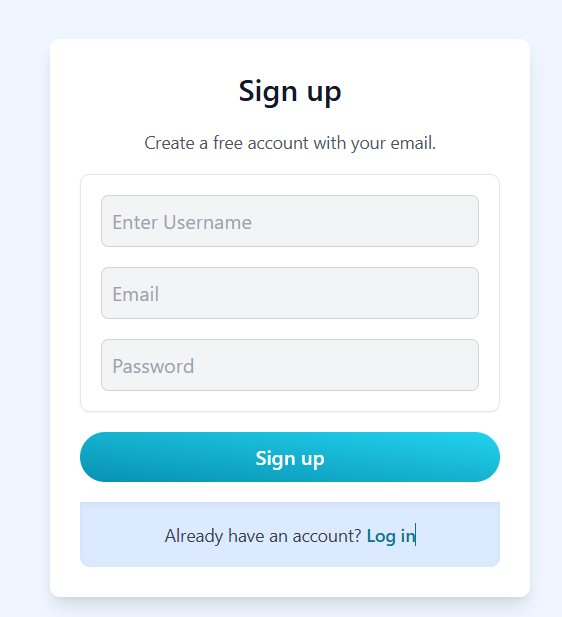
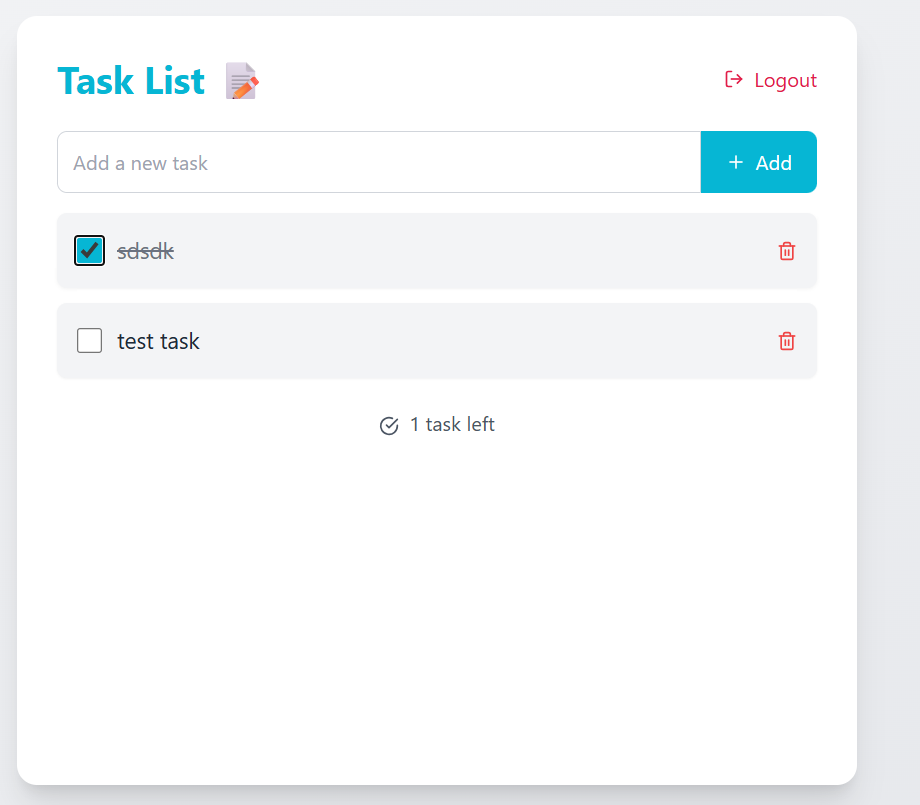

# ✅ Task List Web App

A full-stack Task List application built using React, Node.js, Express, and MongoDB. It allows users to securely manage their daily tasks — create, update, delete, and mark tasks as completed, with user authentication using JWT.

---

## 🚀 Features

- 📝 Create, edit, and delete tasks
- ✅ Mark tasks as completed or pending
- 🔒 JWT-based user authentication
- ☁️ Persistent storage with MongoDB
- 🎨 Responsive UI using Tailwind CSS
- 🍪 Secure cookie handling for sessions
- 📦 RESTful API integration with Axios

---

## 🧰 Tech Stack

| Layer      | Technology                    |
| ---------- | ----------------------------- |
| Frontend   | React.js, Tailwind CSS, Axios |
| Backend    | Node.js, Express.js           |
| Database   | MongoDB, Mongoose             |
| Auth       | JSON Web Tokens (JWT)         |
| Styling    | Tailwind CSS                  |
| Deployment | Render                        |

---

## 📸 Screenshots

### 🖥️ Task List UI







## ⚙️ Installation & Setup

### 🔑 Prerequisites

- Node.js & npm
- MongoDB Atlas account or local MongoDB

---

### 🖥️ Backend Setup

```bash
cd server
npm install
```

Create a `.env` file in the `server` directory:

```
PORT=4001
MONGO_URI=your_mongodb_uri
JWT_SECRET=your_jwt_secret
```

Start the backend:

```bash
npm start
```

---

### 💻 Frontend Setup

```bash
cd client
npm install
npm start
```

Make sure the frontend is configured to call backend on:  
`http://localhost:4001`

---

## 🔐 API Routes

### Auth Routes

| Method | Endpoint       | Description            |
| ------ | -------------- | ---------------------- |
| POST   | `/user/signup` | Register new user      |
| POST   | `/user/login`  | Login existing user    |
| GET    | `/user/logout` | Logout current session |

### Todo Routes (Protected)

| Method | Endpoint           | Description               |
| ------ | ------------------ | ------------------------- |
| GET    | `/todo/featch`     | Get user's todos          |
| POST   | `/todo/create`     | Add new todo              |
| PUT    | `/todo/update/:id` | Update todo (text/status) |
| DELETE | `/todo/delete/:id` | Delete todo               |

---

## 📌 Future Improvements

- 🌙 Dark Mode
- 📅 Add due dates
- 🔍 Search/filter tasks
- 🚚 Drag-and-drop reordering

---

## 🧑‍💻 Author

**Aadarsh**  
_Built with ❤️ using MERN Stack_  
📧 Aadarshkishorsingh@gmail.com

---

## 📄 License

This project is licensed under the MIT License.
